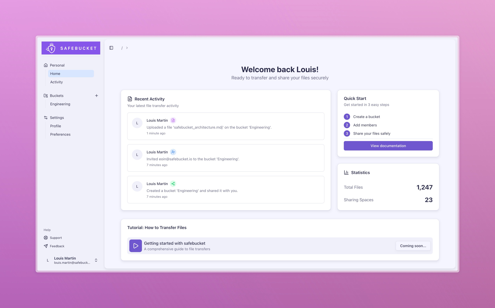

<h1 align="center">
  <a href="https://safebucket.io"></a>
</h1>

## 📖 Introduction

Safebucket is an open-source secure file sharing platform designed to share files in an easy and secure way, integrating
with different cloud providers. Built for individuals and organizations that need to collaborate on files with robust
security, flexible access controls, and seamless multi-cloud support across AWS S3, Google Cloud Storage, and MinIO.



## 🎯 Why Safebucket?
Safebucket eliminates the complexity of secure file sharing by providing a lightweight, stateless solution that integrates seamlessly with your existing infrastructure.
Plug in your preferred auth providers and eliminate the need for local logins - your users can share files using their existing corporate identities.

## ✨ Features

- 🔒 **Secure File Sharing**: Create a bucket to start sharing files and folders with colleagues, customers, and teams
- 👥 **Role-Based Access Control**: Fine grained sharing permissions with owner, contributor, and viewer roles
- 🔐 **SSO Integration**: Single sign-on with any/multiple auth providers and manage their sharing capabilities
- 📧 **User Invitation System**: Invite external collaborators via email
- 📊 **Real-Time Activity Tracking**: Monitor file sharing activity with comprehensive audit trails
- ☁️ **Multi-Storage Integration**: Store and share files across AWS S3, GCP Cloud Storage, or MinIO
- 🚀 **Highly Scalable**: Event-driven and cloud native architecture for high-performance operations

## 🚀 Quick Start

```bash
docker-compose up -d
```

## 🤝 Contributing

We welcome contributions! Please see our [Contributing Guidelines](CONTRIBUTING.md) for details.

1. Fork the repository
2. Create your feature branch (`git checkout -b feature/amazing-feature`)
3. Commit your changes (`git commit -m 'Add some amazing feature'`)
4. Push to the branch (`git push origin feature/amazing-feature`)
5. Open a Pull Request

## 📄 License

This project is licensed under the Apache 2.0 - see the [LICENSE](LICENSE) file for details.

## 🙏 Acknowledgments

- Built with ❤️ using Go and React
- UI components by [Radix UI](https://radix-ui.com) and [shadcn/ui](https://ui.shadcn.com)
- Database ORM by [Gorm](https://gorm.io/index.html)
- RBAC by [Casbin](https://casbin.org)
- Pub/sub integrations by [Watermill](https://watermill.io)
- Configuration management by [Koanf](https://github.com/knadh/koanf)
- Icons by [Lucide](https://lucide.dev)

## 📞 Support

- 🐛 Issues: [GitHub Issues](https://github.com/safebucket/safebucket/issues)
